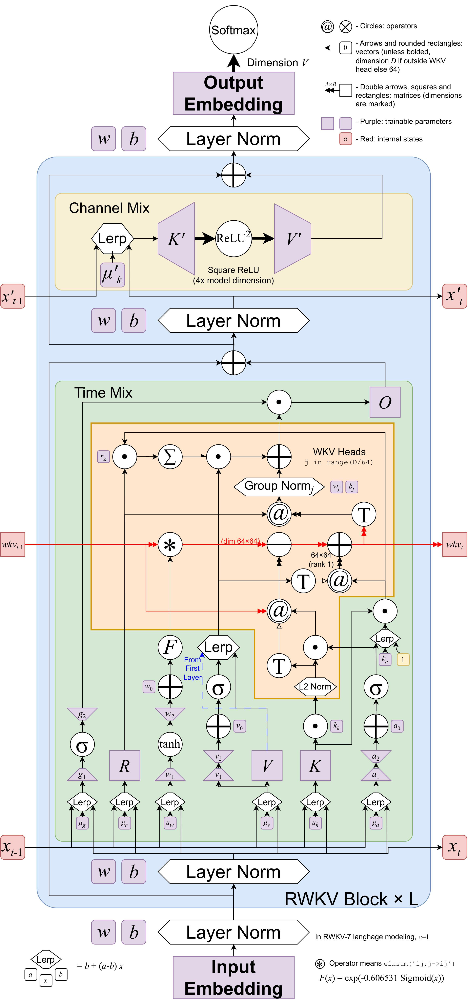
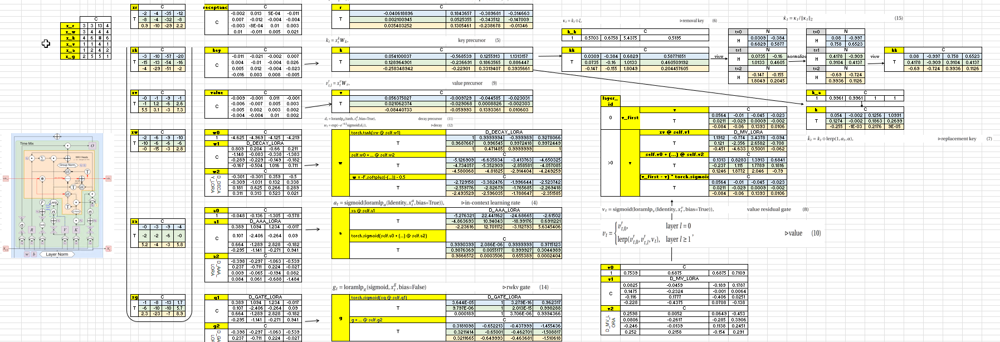
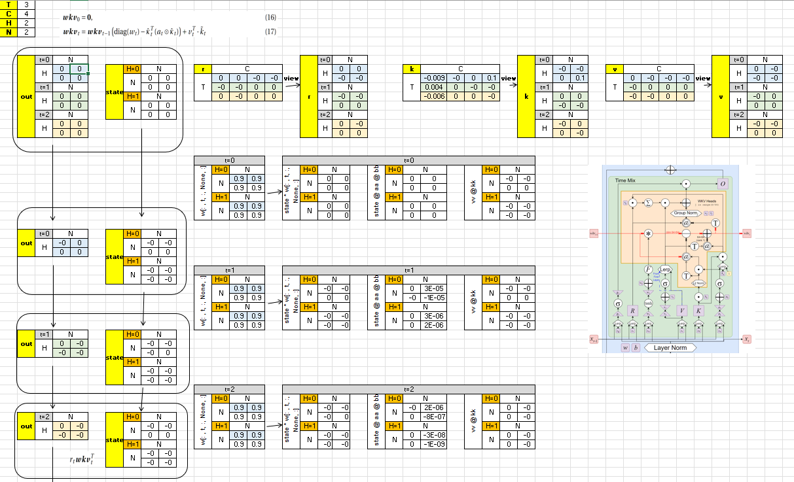
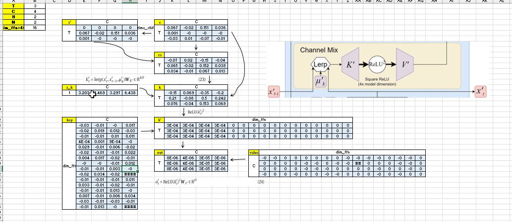

# RWKV-by-hand-excel

[RWKV](https://rwkv.com) by Hand ✍️ Exercises in Excel

This project demonstrates the computation process of the RWKV (Receptance Weighted Key Value) model through Excel spreadsheets. By manually implementing the model's core components, you can gain a deeper understanding of RWKV's internal mechanisms, particularly its innovative TimeMix and ChannelMix approaches.

## RWKV-7
[RWKV-7](https://arxiv.org/abs/2503.14456) "Goose" 🪿 is 100% RNN and a meta-in-context learner, efficiently test-time-training its state on the context via in-context gradient descent at every token in parallel. 

### Model Architecture

### Excel screenshots

## Acknowledgments
This project is inspired by [AI By Hand Excel](https://github.com/ImagineAILab/ai-by-hand-excel/) project.

## License

This project is licensed under the MIT License. See the [LICENSE](LICENSE) file for details.